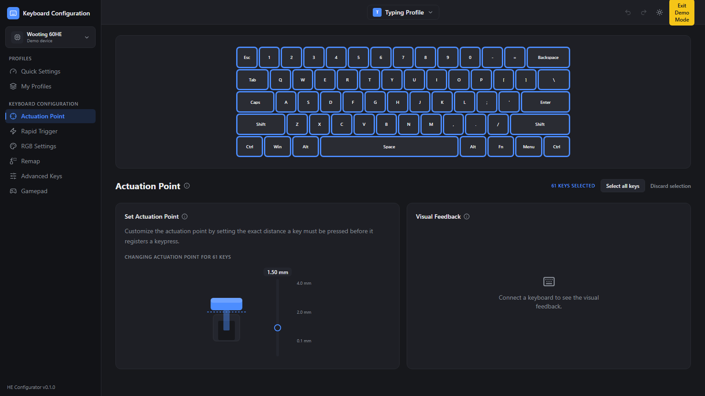
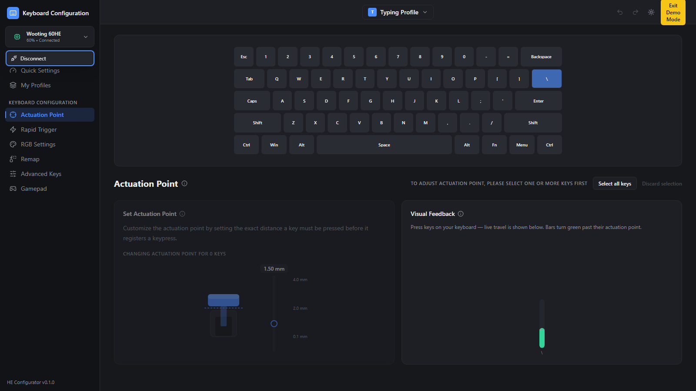
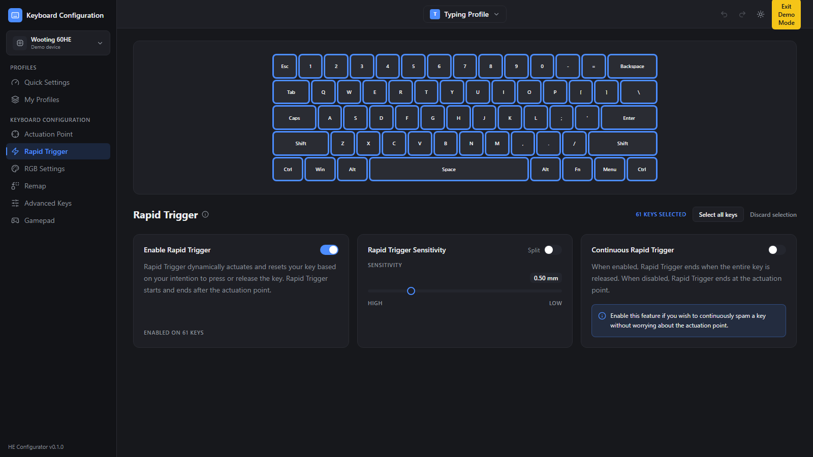
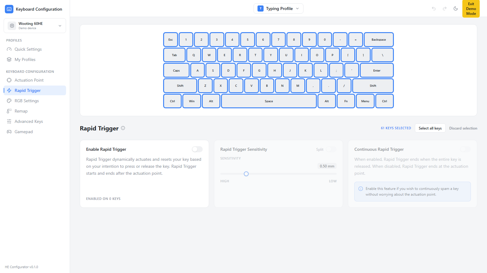
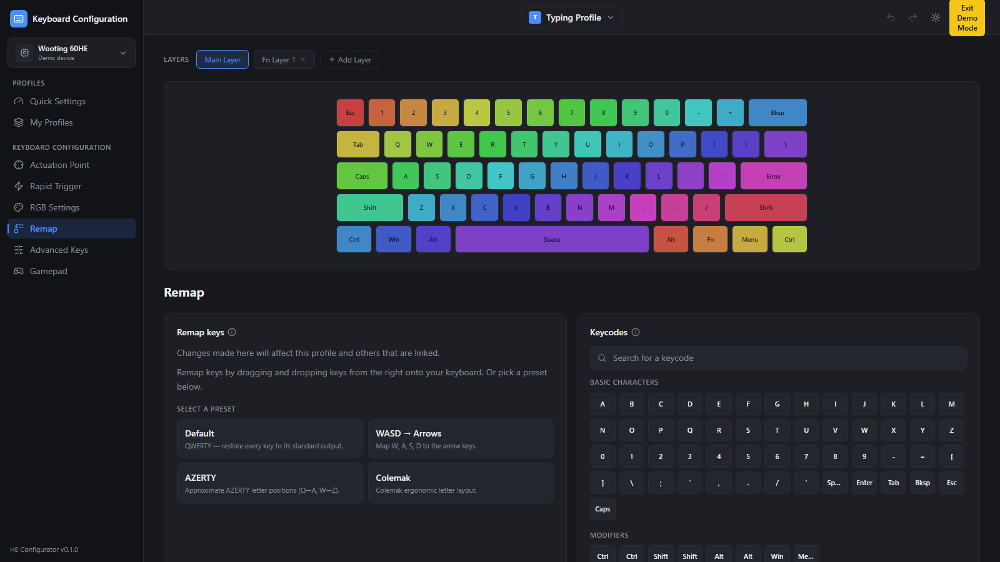
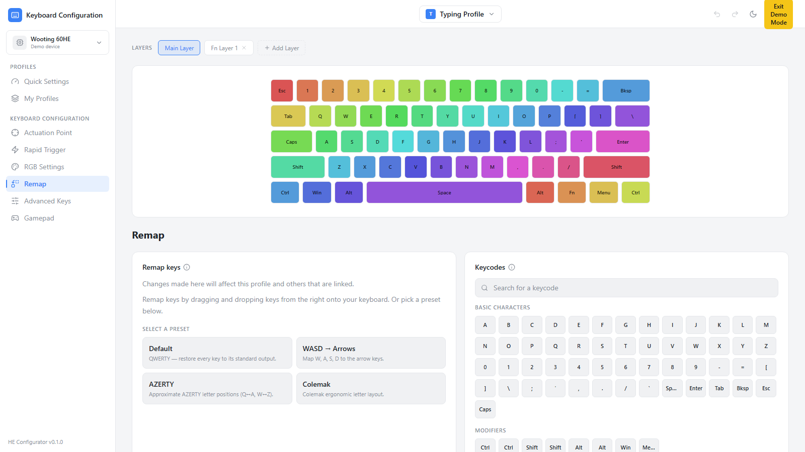

# Dummy UI Demo — Hall-Effect Keyboard Configurator

> **Living document.** Updated after every implementation phase. It records what was built, how to
> run/try it, and whether each phase's acceptance criteria from [DESIGN.md](DESIGN.md) are met.
>
> **Milestone:** UI-first with a fully **mocked device layer** (no firmware/hardware required).
> **Last updated:** 2026-06-01 — Phases 0–7 complete.

---

## What this is

A working React UI for configuring a custom hall-effect keyboard, built to match the three reference
images in [images/](images/). All hardware communication is faked behind a swappable `DeviceService`
so the UI runs and demos end-to-end today; a real HID implementation drops in later (Phase 8).

The app lives in [configurator/](configurator/). It boots in **Demo Mode** — click **Connect demo
device** (or the device card in the sidebar) to simulate a connected keyboard and see live feedback.

---

## How to run

```bash
cd configurator
npm install        # already run; installs deps
npm run dev        # http://localhost:5173
```

Other scripts: `npm run build` (typecheck + production build), `npm run test` (Vitest),
`npm run typecheck`, `npm run format`.

To regenerate the screenshots below: with the dev server running, `node scripts/screenshot.mjs`.

---

## Demo flow (try it in ~60 seconds)

1. App opens on **Actuation Point** in dark mode, showing the 60% keyboard.
2. Click a key, **shift-click** a few more, or **drag** across keys to multi-select. Or hit
   **Select all keys**. The cards activate and show *"Changing actuation point for N keys."*
3. Drag the **Set Actuation Point** slider (0.1–4.0 mm) — the keyswitch illustration depresses.
4. In the sidebar device card, choose **Connect demo device**. After a brief "connecting…", the
   **Visual Feedback** panel animates live key-travel bars (green once past actuation).
5. Open **Rapid Trigger**: toggle **Enable**, drag **Sensitivity** (HIGH↔LOW), flip **Split** to get
   independent Press/Release sliders, toggle **Continuous**.
6. Open **Remap**: switch **Layers**, **drag** a keycode from the right onto a key (or click a key
   then a keycode), or apply a **preset** (Default / WASD→Arrows / AZERTY / Colemak).
7. Toggle the **theme** (sun/moon, top-right) — the whole app switches dark ↔ light.
8. Refresh the page — your profile, per-key config, and keymap persist (localStorage).

---

## Screenshots

### Actuation Point — dark (matches `images/Actuation Point.png`)


### Actuation Point — connected, live Visual Feedback


### Rapid Trigger — dark


### Rapid Trigger — light (matches `images/Rapid Trigger.png`)


### Remap — dark (matches `images/Remap Keys.png`)


### Remap — light


---

## Phase log

Status legend: ✅ done · ⏳ in progress · ⬜ not started.

### Phase 0 — Scaffold ✅
- **Built:** Vite + React 18 + TypeScript; Tailwind with **CSS-variable theme tokens**
  ([src/theme/tokens.css](configurator/src/theme/tokens.css)); Prettier; folder structure per DESIGN.md.
- **Acceptance:** `npm run dev` serves; `npm run typecheck` passes; dark/light toggle works. ✅

### Phase 1 — App shell & navigation ✅
- **Built:** [AppShell](configurator/src/components/layout/AppShell.tsx), [Sidebar](configurator/src/components/layout/Sidebar.tsx)
  (device card + nav groups + version), [TopBar](configurator/src/components/layout/TopBar.tsx)
  (ProfileSwitcher, undo/redo, ThemeToggle, **Exit Demo Mode**), React Router routes for all nav items
  (the 3 config tabs + "Coming soon" placeholders).
- **Acceptance:** Sidebar navigates between tabs; active item highlighted; demo device + profile shown. ✅

### Phase 2 — Device abstraction + mock ✅
- **Built:** [`DeviceService`](configurator/src/device/DeviceService.ts) interface,
  [`MockDeviceService`](configurator/src/device/MockDeviceService.ts) (fake "Wooting 60HE", ~600 ms
  connect latency, `requestAnimationFrame` key-state stream), [`DeviceProvider`](configurator/src/device/DeviceProvider.tsx),
  [`useConnectionStore`](configurator/src/store/useConnectionStore.ts).
- **Acceptance:** Connect/disconnect flips chrome state; subscribers receive animated key-depth values. ✅

### Phase 3 — KeyboardVisualizer ✅
- **Built:** data-driven 60% layout ([layout60.ts](configurator/src/data/layout60.ts)),
  [Keycap](configurator/src/components/shared/Keycap.tsx) +
  [KeyboardVisualizer](configurator/src/components/shared/KeyboardVisualizer.tsx) with
  click / shift-click / **drag-paint** selection, Select-all / Discard, and per-key color + live-depth
  render hooks. Reused by all three tabs.
- **Acceptance:** All selection interactions work; selection count drives the tabs' "N keys" counters. ✅

### Phase 4 — Actuation Point tab ✅
- **Built:** [ActuationPointTab](configurator/src/features/actuation/ActuationPointTab.tsx),
  [SwitchTravelControl](configurator/src/features/actuation/SwitchTravelControl.tsx) (keyswitch SVG +
  vertical mm slider, **0.1–4.0 mm**, step 0.1, default 1.5),
  [VisualFeedbackPanel](configurator/src/features/actuation/VisualFeedbackPanel.tsx) (empty until
  connected, then live bars with per-key actuation line).
- **Acceptance:** Matches dark reference; slider clamps to range; values persist per key; feedback
  animates only when connected. ✅

### Phase 5 — Rapid Trigger tab ✅
- **Built:** [RapidTriggerTab](configurator/src/features/rapidtrigger/RapidTriggerTab.tsx) — Enable
  toggle + "Enabled on N keys"; [SensitivitySlider](configurator/src/features/rapidtrigger/SensitivitySlider.tsx)
  (**0.1–2.0 mm**, step 0.05, default 0.5, HIGH↔LOW); **Split** → Press/Release sliders; Continuous
  toggle + blue info callout.
- **Acceptance:** Matches light reference; enabled-count updates with selection; split reveals two
  sliders; ranges clamp. ✅

### Phase 6 — Remap tab ✅
- **Built:** [RemapTab](configurator/src/features/remap/RemapTab.tsx) with **dnd-kit**;
  [LayerBar](configurator/src/features/remap/LayerBar.tsx) (Main + Fn layers, add/remove);
  [KeycodePicker](configurator/src/features/remap/KeycodePicker.tsx) (search + categories, draggable
  chips); [PresetList](configurator/src/features/remap/PresetList.tsx) (presets + confirm dialog);
  drag-onto-key **and** click-key-then-keycode assignment; reset.
- **Acceptance:** Remapping updates the keycap label; layer switching swaps keymaps; presets apply
  after confirm; search filters. ✅

### Phase 7 — Polish ✅
- **Built:** dark/light parity from one token set; ⓘ info popovers; empty/disabled states
  ("select keys first", "connect a keyboard"); a11y via Radix (ARIA sliders/switches/menus) + visible
  focus rings + keyboard-friendly remap; profile/config/keymap persistence; Vitest tests.
- **Acceptance:** Visual parity vs references (see screenshots); `npm run test` green (5/5);
  `npm run build` clean. ✅

---

## Verification status (2026-06-01)

| Check | Command | Result |
|---|---|---|
| Type safety | `npm run typecheck` | ✅ no errors |
| Production build | `npm run build` | ✅ built (~362 kB JS / 18.7 kB CSS) |
| Unit tests | `npm run test` | ✅ 5/5 passing |
| Dev server | `npm run dev` | ✅ serves 200 on :5173 |

---

## What's mocked vs. real

| Area | Today (UI-first) | Later (Phase 8) |
|---|---|---|
| Device connection | `MockDeviceService` (fake device, simulated latency) | WebHID or Tauri-native HID |
| Live key travel | Random simulated key-press stream | Real analog reports from firmware |
| Config storage | Zustand + `localStorage` | On-device profile storage |
| Apply to hardware | No-op (UI state only) | HID write commands |

---

## Known limitations / next

- No real firmware/HID yet — the protocol is the primary open question (see DESIGN.md).
- RGB Settings, Advanced Keys, Gamepad are placeholders (out of scope this milestone).
- Undo/redo buttons are decorative placeholders.
- Remap rainbow coloring is illustrative (evokes the reference's RGB), not actual lighting config.
- **Phase 8 (future):** wrap in Tauri, implement a real `DeviceService`, integrate with firmware.
